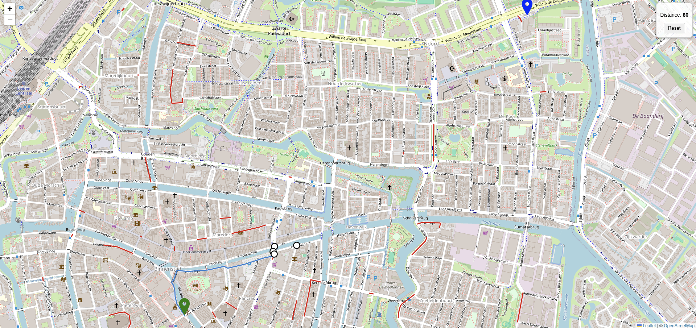

# RouteGuesser

## New Live Demo!
👉 [Play RouteGuesser](https://routeguesser-392262893051.europe-west1.run.app)

## Description
This is the repository for the Routeguesser project. The game starts with two nodes on the map of Leiden: start and end, the objective for the user is to select edges that lead to the end node in such a way that they create an optimal path. Upon reaching the final node, the game displays in percentage the deviation between the user defined path, and the optimal path calculated by the astar algorithm. 
The game also has three difficulty levels. The user can choose from easy, medium and hard difficulties. Easy level is the base game variation, without any changes. In medium mode we introduce random blocked roads on the map, which make it more difficult to reach the end, and finally in hard mode, the user cannot see the blocked edges, unless they bump directly into them.

Routeguesser is a web-based game, which is hosted on a local server. The system consists of two services working together: backend and frontend, which work on two docker containers and communicate with each other. The project was written in Python, JavaScript and HTML. The dataset that we use for the game is stored in a Geojson format and was obtained from: https://overpass-turbo.eu/

## Visuals

This shows a running instance of the game. The start node is marked in green, and the end node is marked in Blue. The blue path depicts the edges that were chosen by the user so far and thus forms the current user path, which end in four white circles. They are the next edge nodes that can be chosen.

## Installation
Prerequisites: Modern Operating System with Windows 10/11, Linux or MacOS, and Docker installed

Install docker cli or docker desktop for your operating system by going to the following website:
https://www.docker.com/products/docker-desktop/

And scrolling down a bit. There you can select the download button and choose a version of Docker that is 
compatible with your operating system. Then after downloading follow the instructions of the installer.

To make the grading and testing process easier, we have created a temporary group related docker account with the following credentials:
Username: group19ta
Password: Password19TA!
This account can be used directly if you don't already have a docker account or don't want to make one.

### Building the container
You can build an image for the routeguesser application and run it by typing:
`docker compose up --build`

in the terminal (can be your IDE terminal or your system terminal) in the main project directory (should be the name of the repository iteself 
and not a subfolder so e.g. C:\Users\Bob\Documents\routeguesser). If your terminal directory is different, change it by typing:

`cd /restofpath/routeguesser`

on Linux, and

`cd \restofpath\routeguesser`

on Windows.

The game application will be available at:
http://localhost:8080/game.html

You can go to this link in a modern browser like Chrome or Firefox and paste it there.

You can verify that the containers are running by going to the docker desktop application or typing:
`docker ps`

in the terminal.

If you wish to uninstall Docker Desktop you can do it easily by searching the name of the application
in your system and then selecting an option to uninstall.

## Usage
You will now see a starting animation of the game and a main menu. Select your desired difficulty or type a custom number of blocked roads and the game will start automatically.

The game will display the start and end nodes, proceed by selecting the neighbouring nodes until you reach the end. You may also reset the game by clicking the reset button. 

At the end of the round, when you reach the final node, you will see the score in percentage, then you can select to start a new round. If you wish to change the difficulty level or go back to the start menu, you can refresh your browser tab by pressing Ctrl + R or the refresh button.

## Authors and acknowledgment
CJ Reitter
Anna Marini
Nico Ramos-Fernandez
Laith Agbaria
Mateusz Wilk
Alex Lopez-Ruiz

## Project status
Project finished, development stopped
